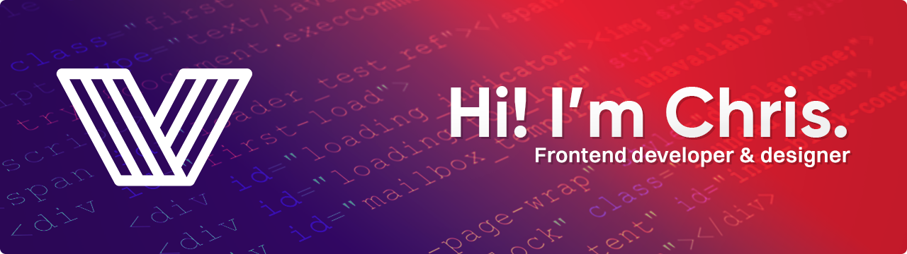

<h1 align="center">Hi there, i'm Chris 👋</h1>

As a passionate frontend developer and designer, I have transformed my love for creativity and technology into a fulfilling hobby. With a keen eye for aesthetics and a strong understanding of user experience, I enjoy crafting visually appealing, interactive websites and applications.

---

## My skills and tools

<!--
**A3Bagged/A3bagged** is a ✨ _special_ ✨ repository because its `README.md` (this file) appears on your GitHub profile.

Here are some ideas to get you started:

- 🔭 I’m currently working on ...
- 🌱 I’m currently learning ...
- 👯 I’m looking to collaborate on ...
- 🤔 I’m looking for help with ...
- 💬 Ask me about ...
- 📫 How to reach me: ...
- 😄 Pronouns: ...
- ⚡ Fun fact: ...
-->
